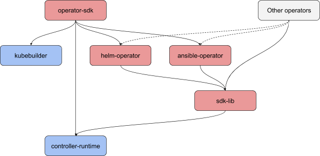

# Split SDK into multiple projects

## Release Signoff Checklist

- [X] Enhancement is `implementable`
- [X] Design details are appropriately documented from clear requirements
- [X] Test plan is defined
- [X] Graduation criteria for dev preview, tech preview, GA

## Open Questions [optional]

1. What do we do with other shared tooling, CI, test helpers, etc. (e.g.
   changelog generator)? Do we need a separate repo for that?
   * Answer: We should visit these on a case by case basis as we see what is needed
     during the splitting.

## Summary

This is the overarching enhancement that will plan how to split functionality
out of the current operator-sdk project into separate projects. The initial
thought on component breakdown mirrors the kubebuilder and controller-runtime
projects:

1. Common libraries and operator building blocks
1. Go scaffolding plugin and the main SDK CLI
1. Helm operator library and scaffolding plugin
1. Ansible operator library and scaffolding plugin

## Motivation

The motivation is to avoid a breaking change in one component causing a major
version bump for all other unrelated components. Another motivation is to make
the projects consumable by other projects as libraries. A benefit would be
better testing and easier to contribute to the smaller projects.

While there are a few complexities with having separate repos, like PR
coordination between repos, or just the working complexity of having to point
at different repos to pick up your dep changes, these are obstacles we can
overcome. They also aren’t that much different from other dependencies we
work with.

### Goals

Split the operator-sdk repo into 4 separate repos:

1. CLI and Go Operator
1. SDK library
1. Helm operator
1. Ansible operator

This SDK library split would be a requirement for a 1.0 release. The Ansible
and Helm operators could go afterwards if need be.

### Non-Goals

* We will not solve the downstream SDK in this enhancement.
* We will not solve all of the items required for a 1.0 release.
* Defining when version bumps occur in each repo.

## Proposal

Split the operator-sdk repo into 4 separate repos as outlined in the Goals
section above.

1. CLI and Go Operator
   * contains the Go operator code
   * contains the CLI code
   * related plugin and scaffolding
   * lives in operator-framework/operator-sdk
   * the split of the CLI/Go Operator repo is dependent on Kubebuilder Phase 2
     to avoid creating a moving target.
1. SDK library
   * contains utility code like package status, status condition, annotated
     watcher, etc.
   * this is something that operator projects (including Helm and Ansible
     operators) would import
   * depends on controller-runtime
   * lives in operator-framework/operator-lib (or some other name TBD)
   * this library should probably *not* be 1.0; it's most likely to change often
   * use Go apidiff tool to determine major version bumps
1. Helm operator
   * contains Helm operator code
   * related plugin and scaffolding
   * lives in operator-framework/helm-operator
   * the Helm plugin is dependent on Kubebuilder Phase 1.
1. Ansible operator
   * contains Ansible operator code
   * related plugin and scaffolding
   * lives in operator-framework/ansible-operator
   * the Ansible plugin is dependent on Kubebuilder Phase 1.

### Tasks

1. Triage pkg directory to determine what goes to which repo
1. Use git commands to extract directories or files with history into these
   new repos. Exact commands will be TBD.
1. Evaluate if making a separate repo for the hack directory is necessary or
   if we just copy it to each of the 4 repos.
1. CLI and Go Operator
   * keep operator-framework/operator-sdk
   * cmd, internal directories remain here
   * prior to 1.0 release, review entire CLI; axe all legacy support for
     existing project layout
   * consider making `generate csv` separate like `controller-gen` to support
     OLM's plan for CSVless bundles (could be done later)
1. SDK library
   * create new repo operator-framework/operator-lib
   * export the directories / files based on task 1 triage.
1. Helm operator and plugin
   * create new repo operator-framework/helm-operator
   * export the pkg/helm tree to the new repo at the top level maintaining
     history
     * There is a plan to deprecate pkg/helm and replace with
       [Joe's helm repo](https://github.com/joelanford/helm-operator) this
       will be covered in a separate proposal to explicitly explain why and
       how this will occur.
1. Ansible operator and plugin
   * create new repo operator-framework/ansible-operator
   * export the pkg/ansible tree to the new repo at the top level
     maintaining history

### Affect on docs website

Today the docs are stored in a website directory in the operator-sdk repo. The
following illustrates how the docs can be split to follow the repos:

1. CLI and Go Operator
   * maintains a website directory that contains the SDK docs, hosted at
     sdk.operatorframework.io
1. SDK library
   * will contain Godocs for the library
1. Helm operator
   * will contain Godocs for the library portion
   * would contain a website directory that contains the Helm docs, hosted at
     helm.operatorframework.io
     * having its own domain means we can version the docs with the releases of
       the Helm operator
1. Ansible operator
   * will contain Godocs for the library portion
   * would contain a website directory that contains the Helm docs, hosted at
     ansible.operatorframework.io
     * having its own domain means we can version the docs with the releases of
       the Ansible operator

### Implementation Details/Notes/Constraints [optional]

See above

### Risks and Mitigations

The biggest risk is the instability that will occur while the projects are
split apart. Once all the projects are in place things will come back together.

## Design Details

### Test Plan

The ultimate test is that e2e tests and manual testing of the SDK binary will
be used to determine it remains functional. Each repo will contain their own
unit test suites and where appropriate e2e tests.

### Graduation Criteria

N/A

### Upgrade / Downgrade Strategy

N/A

### Version Skew Strategy

N/A

## Implementation History

20200603 - Answer the helm-operator question.
20200603 - Address questions from the review.
20200602 - Answered the docs question.
20200601 - Added versioning as a non-goal; Added KB phase 2 note to CLI repo.
20200527 - This document is created.
20200518 - Initial Google Document created to do initial set of review.

## Drawbacks

N/A

## Alternatives

### Docs

An alternative to splitting up the docs would be to build a mechanism to add
docs from Ansible/Helm repos into the main SDK site at build time. This would
keep the top level site as it is now. A drawback would be that the documentation
versioning would be for the entire SDK which negates the individual versioning
we are attempting with splitting the repos.

There are disussions about whether to version the Operator Framework as a whole,
which could affect docs in a major way. It could also affect the underlying
repos as well. This is not something we can solve in this proposal nor should
we.
